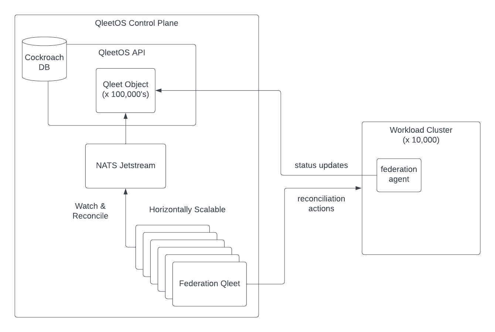

# Kubernetes Federation

This document describes the Threeport approach to managing a fleet of Kubernetes
clusters.

There have been many attempts at federating Kubernetes using Kubernetes itself,
i.e. Kubernetes Operators that install and keep an inventory of clusters as well
as manage multi-cluster app deployments.  Kubernetes was designed to be a
datacenter abstraction, not a global software fleet abstraction.  It has
inherent scaling and availability constraints that prevent it from providing
this global abstraction layer.

A global federation layer must be highly scalable and have geo-redundant
availability.  A control plane for all your software deployments must have the
appropriate capacity and resilience for the task.

## Kubernetes Controllers

[Kubernetes controllers](https://kubernetes.io/docs/concepts/architecture/controller/)
are not horizontally scalable.  When deployed in a highly
available configuration, only one controller is active at any given time and
they use leader election to determine which of a set of identical controllers
manage operations at any given time.  In the case of a larger retailer that uses
Kubernetes in their outlets, they may have many thousands of clusters to manage
along with the software in those clusters.  This is a demanding volume of state
to reconcile for a single controller.

## Kubernetes Datastore

Kubernetes uses [etcd](https://etcd.io/) which is an excellent distributed
key-value store.  It has served Kubernetes very well in its purpose.  However,
etcd works best in a single region.  Tuning for the increased latency of
cross-region etcd clusters is possible, but treacherous.  Furthermore, it is not
a relational database which means if you need transactional capabilities that
allow a database to make changes to multiple objects with ACID guarantees, etcd
is not the best choice.

## Threeport Controllers

Threeport controllers inherit a lot of design principles from Kubernetes.  They
are level-triggered reconcilers of state that operate on a non-terminating loop
to ensure your desired state is realized in the system.  One thing that
Threeport controllers add is horizontal scalability.  Any number of Threeport
Controllers can operate simultaneously to manage the same set of object types.
They use NATS Jetstream to broker notifications to help achieve this.  In
Threeport, the message broker helps ensure a notification of a particular change
is delivered to just one of a set of identical Threeport controllers.  Threeport
controllers use the message broker to place distributed locks on specific objects while they are
being reconciled so that race conditions between controllers don't develop in making
changes to the system.

## Threeport Datastore

Threeport uses CockroachDB, a purpose-built geo-redundant relational database.  The
geo-redundancy is essential for a purpose that is this critical.  And the
transactional capabilities allow changes to multiple related objects to happen
safely.  When you are dealing with remote clusters and the workloads therein,
changes that affect multiple objects are common.  Being able to apply a change
to all the affected objects _or_ none at all if a problem occurs, is an
important guarantee to have for stability.

