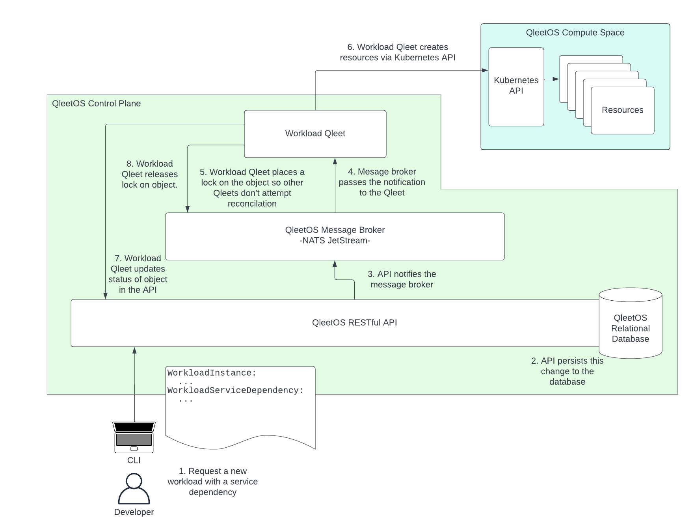
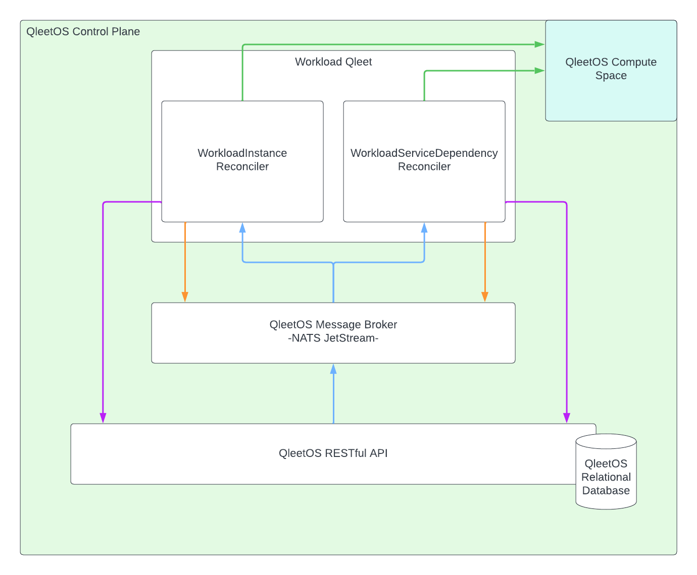

# Qleets

Qleets are what we call our Qleet Controllers.  They provide the functionality,
the operational reconciliation of state in the system.  When a user deploys a
workload, the change is made to the datastore through the QleetOS RESTful API.
Once that change has been successfully persisted, the API notifies the
appropriate controller via the message broker.  The Qleet responsible for
deploying the workload then executes the action and updates the status of the
object in the API.

1. A developer requests a workload deployment and a service dependency for that
   workload.  A WorkloadServiceDependency is QleetOS mechanism for managing
   back end services for workloads independently of the workload.  For an
   example of how this works, see the [summary](guides/getting-started/#summary)
   of our getting started guide.
2. The API writes the new objects to the database.
3. Once persisted the API notifies the message broker of the change, including the
   database ID of the objects in question.
4. The message broker delivers the notification to the correct Qleet.  If no
   Qleet is available immediately due to load or temporary outage, the NATS
   Jetstream broker holds the message until a Qleet instance becomes available.
5. The Qleet puts a lock on the specific object by type and unique ID.  That way
   if another change is made to the same object before reconciliation is
   complete, the first change is completed and then the second change is
   executed so that race conditions don't develop.  In the event that a
   reconciliation cannot be completed, such as when a lock exists on a particular
   object, the notification is requeued through the broker so that it is
   performed at a later time.
6. Reconciliation is completed.  In this case the workload will be deployed and
   the configuration for the service dependency is applied through the
   Kubernetes API of the target cluster for the workload.
7. Once the operation is successfully reconciled, the Workload Qleet updates the
   status of the object through the API.
8. Finally, the Qleet releases the lock on the object instance so that it may
   undergo any future reconciliation.

## Reconcilers

To drill into a little more detail, a Qleet internally consists of one or more
reconcilers.  Each reconciler is responsible for the state of a single object
type.  To continue the example above, two objects were created by the developer.
A WorkloadInstance and a WorkloadServiceDependency.  The Workload Qleet has a
distinct reconciler for each object.

Note: this illustration does not include an exhaustive list of reconcilers in
the Workload Qleet.  It is just a representation of the components involved
in the example from above.

The blue arrows illustrate the notifications that are sent to the reconcilers
when a change occurs in the system.

The orange arrows represent the communication from the reconcilers to the
message broker.  They first check to see if a lock exists on a particular object
before reconciling.  If no lock is found, they place a lock and reconcile.  If a
lock is found, they requeue the notification - usually after some short period -
so that reconciliation can occur at a later time if needed.  Once reconciliation
is complete, the lock is released.

The green arrows show the calls from the reconcilers to the Kubernetes API in
the Compute Space.  The Kubernetes API provides the primary interface point for
the reconcilers.  No calls are made into processes or workloads in those
clusters as a rule.  Any custom operations that are not satisfied
by Kubernetes are achieved with custom Kubernetes Operators that can be
configured and triggered through the Kubernetes API.

The purple arrows show the calls back to the API to update other related objects
or write the status of the object reconciled.

