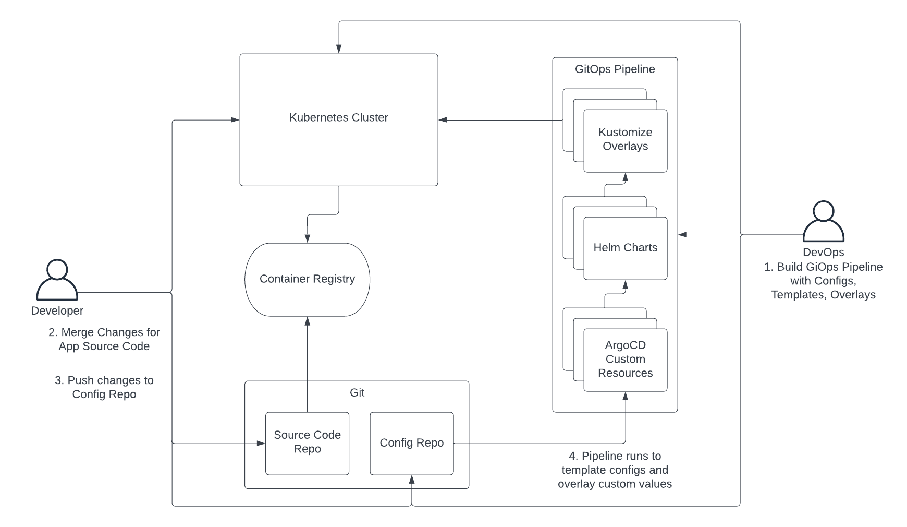
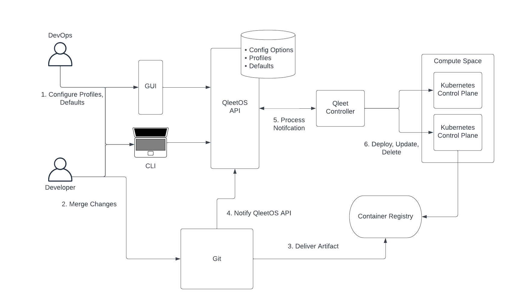

# Software Delivery

A software supply chain generally consists of the following:

* Software Development: The tools, libraries and source code repos used by the
  developer to build software.
* Continuous Integration: The automated tests and builds that occur when code is
  pushed and/or merged to a branch.
* Continuous Delivery: The automated delivery of the build artifacts into their
  runtime environment.  This includes the configuration of the workloads for
  their destination environment.

QleetOS plays no part in software development or continuous integration.  The
delivery of the software into its runtime environment, however,  is a direct
concern of QleetOS.

## GitOps Approach

In recent times, GitOps has become the predominant methodology to manage
software delivery.
In this model, configuration is stored in code repositories and templating tools
like [Helm](https://helm.sh/) and [Kustomize](https://kustomize.io/) are
employed to apply specific environment-specific values to those configs.  When
infrastructure is being managed, [Terraform](https://www.terraform.io/) is often
used.  And general config management is commonly achieved with
[Ansible](https://www.ansible.com/).  These are all excellent tools unto
themselves but as a part of a sophisticated, production delivery system, they
risk becoming brittle, complicated to develop and troublesome to use and
troubleshoot.

0. Ahead of time, the GitOps engineer builds the GitOps pipeline which generally
   includes Helm templates and Kustomize overlays.  The pipeline itself also must
   be configured.  A popular choice is ArgoCD and, in that case, the pipelines
   are configured using their Kubernetes custom resources.
1. The developer merges changes to their application which fires off a
   continuous integration process to test and build their app.
2. The developer pushes a change to the config repo.  This would include an
   update to the version of the container image they wish to deploy.  They would
   usually apply that change to the branch that corresponds to the environment
   they wish to deploy to.
3. The GitOps pipeline is triggered by the change and runs the templating and
   overlay operations to render complete Kubernetes manifests that are then
   applied to the cluster.

This GitOps workflow can work fine in simple use cases.  The problems arise
as sophistication increases.  Helm templates often become overwhelmed with
conditional and looping logic that is messy to express in templating languages.
The additional complexity of multiple layers of configuration with Helm and
Kustomize make it challenging just to figure out where values are being set.
And since such pipelines are difficult to test before use, they tend to be
brittle and interrupt day-to-day operations.

The complexity is increased further if there are controllers in your system that update
resource configurations that have been defined in a config repo.  You then have
to either tell your GitOps engine to ignore some changes or push those changes
back into the code repo from your runtime environment.

## QleetOS Approach

QleetOS uses an API-driven - rather than code repo driven - approach.  This is
based on two principles:

* A database is the best place to store values that need to be updated by humans
  *and* software systems.  Configurations for software deployments fall into
  this category.  Code repos are ideal for managing software source code being written
  by different members of a team.  But code repos are primarily a human interface.
  Deployment configurations ideally are set initially by humans but managed by
  software controllers on day 2.  Today, we commonly use autoscalers to adjust replica
  counts and node counts.  And this trend will continue in many parts of
  workload config management.
* Purpose-built controllers that are level-triggered and can perform complex
  evaluation of inputs provide the best result for managing the deployment of
  sophisticated software systems to their runtime environment.  Like all
  software, they can have unit and end-to-end tests run before release to
  improve stability.

0. Ahead of time, the DevOps engineer configures profiles for applications and
   provides default settings that suit the organization's policies.  These
   provide the guardrails and rules leveraged by the developer to deploy.
1. The developer merges changes that trigger a CI process using, for example,
   Github workflows.  This typically runs automated tests and build processes.
2. The final build artifact is generally a container image that is pushed to a
   container registry to become available to run in an environment.
3. The final step in the CI workflow is a call to the QleetOS API to register the
   new workload artifact - the container image.
4. Inside the QleetOS control plane, the Qleet Controller responsible for
   software delivery is notified of the change and processes the preset config
   options, profiles and defaults for the new image.  It decides, based on the
   settings in the database, whether to deploy the new workload version to an
   environment or do nothing at all.  Commonly, the new version will be
   immediately deployed to a dev environment while a deployment to a production
   environment would require an explicit action taken through the QleetOS CLI or
   GUI by the developer or other team member.
5. Any deployments, updates and deletes are then conducted by the Qleet
   Controller in the Compute Space by calling the relevant Kubernetes API
   instances running the environments in question.

Subsequently, the developer and other team members can then retrieve status
updates and operational data - including any errors - for the new deployment
through the QleetOS control plane.

