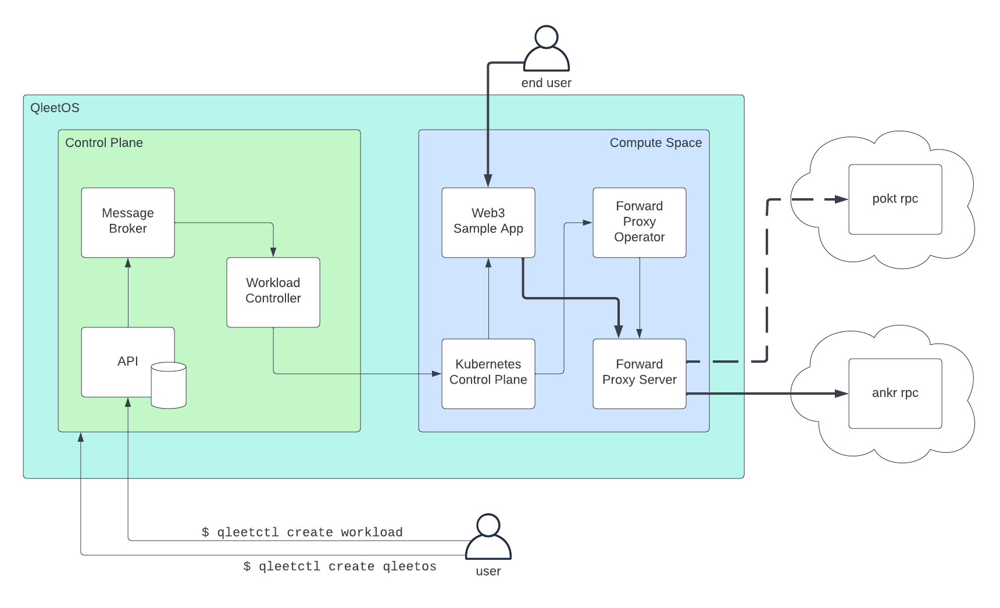

# Getting Started

In this guide we'll install the qleetctl CLI tool on your local machine and then
install the QleetOS control plane locally using qleetctl.  Then we'll install a
sample app using QleetOS.

## Install qleetctl

You can install qleetctl using Homebrew or by downloading the binary release from
Github.

### Homebrew

[Homebrew](https://brew.sh/) offers the simplest install for Mac and Linux and
is the recommended install method:

```bash
brew tap qleet/tap
brew install qleet/tap/qleetctl
```

### Binary Install

Currently, qleetctl requires that you have the following tools installed on your
local machine.  If you use Homebrew to install, these dependencies will be
handled for you.  Otherwise, ensure these tools are installed first:

* [docker](https://docs.docker.com/engine/install/)
* [kind](https://kind.sigs.k8s.io/docs/user/quick-start/#installation)
* [kubectl](https://kubernetes.io/docs/tasks/tools/#kubectl)
* [curl](https://help.ubidots.com/en/articles/2165289-learn-how-to-install-run-curl-on-windows-macosx-linux)
* [wget](https://www.gnu.org/software/wget/)
* [jq](https://github.com/stedolan/jq/wiki/Installation)

Then install qleetctl:

```bash
VERSION=$(curl --silent "https://api.github.com/repos/qleet/qleetctl/releases/latest" | jq '.tag_name' -r)
wget https://github.com/qleet/qleetctl/releases/download/${VERSION}/qleetctl_${VERSION}_$(echo $(uname))_$(uname -m).tar.gz -O - |\
    tar -xz && sudo mv qleetctl /usr/local/bin/qleetctl
```

Usage info for qleetctl can be seen as follows:

```bash
qleetctl help
```

## Install QleetOS

To install the QleetOS control plane locally:

```bash
qleetctl create qleetos --name test
```

This will create a local kind Kubernetes cluster and install all of the control
plane components.  It will also register the same kind cluster as the default
compute space cluster for tenant workloads.

To view the pods that constitute the QleetOS control plane:

```bash
kubectl get po -n threeport-control-plane
```

Note: Threeport is the name of the control plane.  You can think of Threeport as
the kernel and QleetOS as a distribution of the operating system.

The QleetOS API is now available at localhost:1323.  Ensure that it is up and
running by opening the Swagger API docs at:
[http://localhost:1323/swagger/index.html](http://localhost:1323/swagger/index.html).

## Deploy A Workload

To deploy a workload using QleetOS, you minimally need to create two API objects:
a `WorkloadDefinition` and a `WorkloadInstance`.  For this example, we're also
going to create a `WorkloadServiceDependency` to manage connections to the
blockchain.  More on this shortly.  We can create all three resources with a
single configuration file.

First, create a workspace on your local filesystem:

```bash
mkdir qleetos-test
cd qleetos-test
```

Download a sample workload config as follows:

```bash
curl -O https://raw.githubusercontent.com/qleet/qleetctl/main/sample/go-web3-workload.yaml
```

You now have the workload config on your local filesystem.  If you open the file
you'll see it has a configuration for the three resources.  Let's dig into what
each of them represent:

### Workload Definition

The `WorkloadDefinition` is what it sounds like: a definition for a workload
that can be deployed as many times as you like.  It includes a field
`YAMLDocument` that refers to a file on your filesystem.  Let's download that
file:

```bash
mkdir sample
curl -o sample/go-web3-sample-app-manifest.yaml https://raw.githubusercontent.com/qleet/qleetctl/main/sample/go-web3-sample-app-manifest.yaml
```

That file contains Kubernetes manifest for four resources: a namespace,
configmap, deployment and service.  Note that the configmap tells the sample app
to use `http://forward-proxy.forward-proxy-system.svc.cluster.local` for its
RPC endpoint.  This URL uses a local DNS entry that will be set up by QleetOS as
defined by the Workload Service Dependency which we'll discuss in more detail
shortly.

### Workload Instance
The `WorkloadInstance` refers to the workload definition and actually deploys
the instance of the workload.  It also refers to the cluster which is set up as
the default when we created QleetOS above.

### Workload Service Dependency

The `Workload Service Dependency` creates a method to manage services that are
accessed by your app over the network.  When you create a workload service
dependency, QleetOS provisions a forward proxy.  This forward proxy consists of
an Envoy proxy and a Kubernetes operator that configures Envoy to forward
traffic to a given destination.  In this case, when the sample app calls the
proxy, Envoy will forward the request to `rpc.ankr.com/eth` which is a publicly
available RPC service provided by [ankr](https://www.ankr.com/).

We can now create the workload as follows:

```bash
qleetctl create workload --config go-web3-workload.yaml
```

This command calls the the Qleet API to create those three Qleet objects.  The
API notifies the workload controller via the message broker.  The workload
controller processes the workload definition and creates the workload by calling
the Kubernetes API.  Also, since a workload service dependency was created, the
workload controller deploys the forward proxy components and configures the
Envoy proxy.

You can see the forward proxy components as follows:

```bash
kubectl get po -n forward-proxy-system
```

You should see a pair of pods for the `forward-proxy-server` deployment.  These
are the Envoy proxy.  Also, you should find a
`forward-proxy-controller-manaager`.  This is the Kubernetes operator that
serves as a control plane for Envoy and configures it.  It uses a ForwardProxy
custom resource that was created by the workload controller.  You can see the
content of that resource with the following:

```bash
kubectl get forwardproxy -n forward-proxy-system -oyaml
```

Once the forward proxy is running and configured, the sample app can start and
connect to its RPC endpoint.  You can see that workload with:

```bash
kubectl get po -n go-web3-sample-app
```

You can now see the sample by forwarding a local port to it with this command:

```bash
kubectl port-forward -n go-web3-sample-app svc/go-web3-sample-app 8888:8080
```

Now visit the app [here](http://localhost:8888).  It will display the balance of
an Ethereum wallet by getting the information from the blockchain.

## Update the Service Dependency

Next, let's update the service dependency.  Download a new service dependency
config:

```bash
curl -O https://raw.githubusercontent.com/qleet/qleetctl/main/sample/go-web3-service-dependency-pokt.yaml
```

This config file contains a new publicly available RPC endpoint to gain access
to the Ethereum blockchain.  This one uses the [POKT
network](https://www.pokt.network/).

Update the serviced dependency:

```bash
qleetctl update workload-service-dependency --config go-web3-service-dependency-pokt.yaml
```

This command changes the workload service dependency which prompts the workload
controller to update the ForwardProxy config.  This triggers the forward proxy
operator to update the Envoy config.  You can see the updated forward proxy as
follows:

```bash
kubectl get forwardproxy -n forward-proxy-system -oyaml
```

If you try out the sample app again, you'll see it still can access the
blockchain, but through a different provider.  This service dependency is
managed independently of the sample app.  No restart, hot reload or config
reload of any kind is required by the sample app.  It remains using the RPC
endpoint configured in its configmap and the Envoy proxy forwards the request to
the correct destination on its behalf.

## Summary

This diagram illustrates the relationships between components introduced in this
guide.



When we installed QleetOS using `qleetctl create qleetos` we created a new
control plane on a local kind Kubernetes cluster.

When we installed the sample app using `qleetctl create workload` we called the
API to create the three workload objects: a definition, instance and service
dependency.  The reconciliation for these objects was carried out by the
workload controller which created the necessary Kubernetes resources via the
Kubernetes control plane.  We spun up the sample app itself as well as the
forward proxy components which manage connections to the Ethereum RPC providers
needed by the sample app.

When the end user queries the sample app for the balance of an Ethereum wallet,
the sample app calls the forward proxy server which forwards the request to the
destination configured by the QleetOS user.

Importantly, all dependencies are created in response to, and only when needed
by, a tenant workload - the sample app in this case.  In this way QleetOS is
application-centric.  It responds to app requirements and creates
dependent services in response to those requirements, as opposed to most
workload management systems that require infrastructure and support services to
be installed ahead of time.

## Clean Up

To uninstall the QleetOS control plane locally:

```bash
qleetctl delete qleetos -n test
```

Remove the test configs from you filesystem:

```bash
cd ../
rm -rf qleetos-test
```

