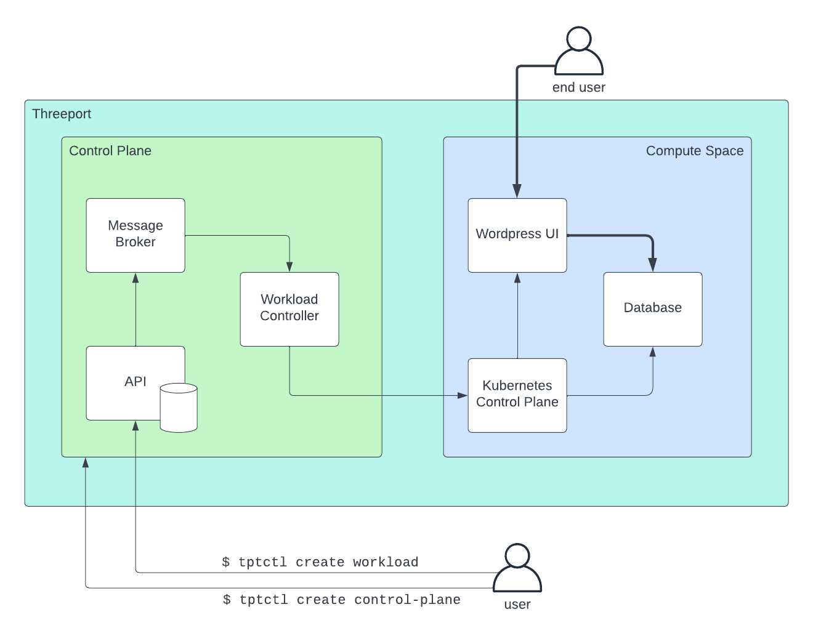

# Getting Started

This guide consists of the following parts:

* [Install tptctl](#install-tptctl): tptctl is the Threeport command line tool
  used to manage Threeport itself as well as workloads that run on Threeport.
* [Install Threeport](#install-threeport): before you can manage workloads using
  Threeport, you first need an instance of the Threeport control plane.
* [Deploy a Workload](#deploy-a-workload): deploy a wordpress sample app on
  Threeport.
* [Summary](#summary): review what we did in this guide.
* [Clean Up](#clean-up): tear down the workload and the control plane.

## Install tptctl

Note: while we're building releases for Windows, they are not tested and not
expected to work at this time.

### Get Latest Version

If you have `jq` installed, run the following command:

```bash
TPTCTL_VERSION=$(curl -s "https://api.github.com/repos/threeport/releases/releases/latest" | jq '.tag_name' -r)
```

Otherwise, look up the version at the [releases
page](https://github.com/threeport/releases/releases) and set it like so:

```bash
TPTCTL_VERSION=v0.2.1  # substitute latest version
```

### Download

Download the release and checksums:
```bash
curl -LO "https://github.com/threeport/releases/releases/download/$TPTCTL_VERSION/tptctl_${TPTCTL_VERSION}_$(uname)_$(uname -m).tar.gz"
curl -L "https://github.com/threeport/releases/releases/download/$TPTCTL_VERSION/checksums.txt" > checksums.txt
```

### Verify

Optional but recommended.

Run the following command on Linux to verify the integrity of the package:

```bash
sha256sum -c --ignore-missing checksums.txt
```

### Install

```bash
tar xf tptctl_${TPTCTL_VERSION}_$(uname)_$(uname -m).tar.gz
sudo mv tptctl_${TPTCTL_VERSION}_$(uname)_$(uname -m)/tptctl /usr/local/bin
```

### Cleanup

```bash
rm checksums.txt tptctl_${TPTCTL_VERSION}_$(uname)_$(uname -m).tar.gz
rm -rf tptctl_${TPTCTL_VERSION}_$(uname)_$(uname -m)
```

### View Usage Info

```bash
tptctl help
```

### Note for MacOS Users

If you have issues running `tptctl` on your machine, follow the steps outlined by Apple
[here](https://support.apple.com/guide/mac-help/open-a-mac-app-from-an-unidentified-developer-mh40616/mac).

## Install Threeport

The Threeport control plane itself runs on Kubernetes.  Currently, it can be
deployed on one of two providers:

* [Kind](https://kind.sigs.k8s.io/): this will run Kubernetes in docker
  containers on your local machine and install Threeport there.  It requires you
  have docker installed on your machine.  This is useful for testing out
  Threeport and getting an idea of how it works.
* [AWS Elastic Kubernetes Service](https://aws.amazon.com/eks/): this will spin
  up a Kubernetes cluster in AWS and install Threeport there.  It requires you
  have an AWS account and API keys.  This is useful for testing Threeport on a
  remote cloud provider.

### Kind

In order to run Threeport locally, you must first have [Docker
Desktop](https://docs.docker.com/desktop/install/mac-install/) installed if on a
Mac or [Docker Engine](https://docs.docker.com/engine/install/) on Linux.

If you are on Ubuntu you can install and add your user to the docker group as
follows:

```bash
sudo apt-get install gcc docker.io
sudo usermod -aG docker $USER
```

To install the Threeport control plane locally:

```bash
tptctl create control-plane \
    --provider=kind \
    --name=test
```

By default, `tptctl` will generate and use a keypair for authentication to the Threeport
API. If you wish to disable this behavior and expose the Threeport API via HTTP, append
the `--auth-enabled=false` flag. This will also expose Threeport API [Swagger](https://swagger.io/)
documentation at [http://localhost/swagger/index.html](http://localhost/swagger/index.html).

```bash
tptctl create control-plane \
    --provider=kind \
    --name=test \
    --auth-enabled=false
```

It will take a few minutes for this process to complete.

This will create a local kind Kubernetes cluster and install all of the control
plane components.  It will also register the same kind cluster as the default
compute space cluster for tenant workloads.

### EKS

This section assumes you already have an AWS account and credentials configured on
your local machine with a profile named "default".  Follow their
[quickstart page](https://docs.aws.amazon.com/cli/latest/userguide/getting-started-quickstart.html)
for steps on how to do this.

Note: if you have the `~/.aws/config` and `~/.aws/credentials` files on your
filesystem, you're likely already set up.

Also, ensure you have the required permissions to create the necessary resources
in AWS.  If your user has the built-in `AdministratorAccess` policy attached, you can
continue.  Otherwise, check out our [AWS Permissions guide](/guides/aws-iam)
to make sure you can create the resources required to run a Threeport control plane.

You also will need your AWS account ID.  It can be found in the AWS console.
Log in to AWS and look a the top-right of the console.  It will say something like
`username @ 1111-2222-3333`.  The 12 digit number (without dashes) is your account ID.

With credentials configured, run the following to install the Threeport control plane in EKS:

```bash
tptctl create control-plane \
    --provider eks \
    --provider-account-id [your AWS account number] \
    --name test
```

This process will usually take 10-15 minutes.  It can take even longer on some
AWS accounts.  You will see ouput as AWS resources are created. We don't recommend using
`--auth-enabled=false` when deploying to EKS because the Threeport API would be exposed to
the public internet via HTTP and without authentication.

It will create a remote EKS Kubernetes cluster and install all of the control plane
components.  It will also register the same EKS cluster as the default compute space
cluster for tenant workloads.

Note: if you would like to use
[kubectl](https://kubernetes.io/docs/tasks/tools/#kubectl)
against the cluter where Threeport is
running and you have the [AWS CLI](https://aws.amazon.com/cli/)
installed you can update your kubeconfig
with:

```bash
aws eks update-kubeconfig --name threeport-test
```

### Validate Deployment

If you have `kubectl` installed and wish to view the pods that constitute the
Threeport control plane:

```bash
kubectl get pods -n threeport-control-plane
```

Note: if you notice any pods crashlooping, give them a few minutes.  The
workload controller depends on the API server which, in turn, depends on the
database and message broker.  Each component will come up once its dependencies
are running.

## Deploy a Workload

In this guide, we're going to use the simplest possible mechanism to deploy an
app.  It uses a very basic workload config.

First, create a workspace on your local filesystem:

```bash
mkdir threeport-test
cd threeport-test
```

Download a sample workload config as follows:

```bash
curl -O https://raw.githubusercontent.com/threeport/releases/main/samples/wordpress-workload.yaml
```

You now have the workload config on your local filesystem.  If you open the file you'll
see it has the following fields:

```yaml
Workload:
  Name: "wordpress"
  YAMLDocument: "wordpress-manifest.yaml"
  KubernetesRuntimeInstance:
    Name: compute-space-dev-0-0
  # DomainName:
  #   Name: www.example.com
  #   Zone: Public
  #   AdminEmail: admin@example.com
  # Gateway:
  #   TCPPort: 443
  #   Path: /
  #   TLSEnabled: true
  #   ServiceName: getting-started-wordpress


```

The `Name` field is an arbitrary user-defined name that must be unique, i.e. no
other workload may use the same name.

The `YAMLDocument` field refers to another file with the Kubernetes resource
manifests.  Download that file as well:

```bash
curl -O https://raw.githubusercontent.com/threeport/releases/main/samples/wordpress-manifest.yaml
```

The `KubernetesRuntimeInstance` field refers to the compute space cluster that we wish to
deploy to. It is already populated with the default compute space cluster.

The remaining `DomainName` and `Gateway` fields are used to expose the wordpress
application via HTTPS at a specified domain. These may be uncommented if you have deployed to
EKS and have a Hosted Zone configured in Route53.

That's all you need in order to deploy.

### Create Workload

We can now create the workload as follows:

```bash
tptctl create workload --config wordpress-workload.yaml
```

This command calls the the Threeport API to create the Workload objects.
The API notifies the workload controller via the message broker.  The workload
controller processes the workload definition and creates the workload instance
by calling the Kubernetes API.

We can use `tptctl` to view deployed workloads:

```bash
tptctl get workloads
```

We can also use `kubectl` to query the Kubernetes API directly. First, set a local
environment variable to the appropriate namespace for the Wordpress application:

```bash
NAMESPACE=$(kubectl get namespace -l app.kubernetes.io/name=wordpress -o=jsonpath='{.items[0].metadata.name}')
```

Confirm the Wordpress application is running with:

```bash
kubectl get pods -l app.kubernetes.io/instance=getting-started -n $NAMESPACE
```

If using the kind provider, you can now visit the Wordpress application by
forwarding a local port to it with this command:

```bash
kubectl port-forward svc/getting-started-wordpress 8080:80 -n $NAMESPACE
```

Now visit the app [here](http://localhost:8080).  It will display the welcome screen of
the Wordpress application.

If using the EKS provider with `DomainName` and `Gateway` fields uncommented, you should
soon be able to navigate to your specified domain name and view the Wordpress app via
HTTPS in your browser.

## Summary

This diagram illustrates the relationships between components introduced in this
guide.



When we installed Threeport using `tptctl create threeport` we created a new
control plane on a new Kubernetes cluster.

When we installed the sample app using `tptctl create workload` we called the API to
create the two workload objects: a definition and an instance.  The reconciliation for
these objects was carried out by the workload controller which created the necessary
Kubernetes resources via the Kubernetes control plane.

While this approach doesn't provide any special outcomes that you could not have
achieved with other tools, it does do something unique under the hood.  It
manages Kubernetes workloads using a workload abstraction and piece of software
known as a workload controller.  This enables many benefits that will be in
upcoming releases:

* Support Service Dependency Management: Installing and configuring support
  services such as ingress, TLS termination, DNS management and more.
* Cloud Provider Service Dependency Management: Calling cloud providers on your
  behalf to spin up managed services such as S3 and RDS that your app relies on.
* Runtime Dependency Management: If you need to run your workload in a new
  region or on a different cloud provider, Threeport can manage those
  dependencies at runtime with the intelligence of a software controller (as
  opposed to configs that are rendered with templates or overlays using
  human-defined environment-specific values).

## Clean Up

To delete a workload:
```bash
tptctl delete workload --config wordpress-workload.yaml
```

To uninstall the Threeport control plane locally:

```bash
tptctl delete control-plane -n test
```

Remove the test configs from you filesystem:

```bash
cd ../
rm -rf threeport-test
```

