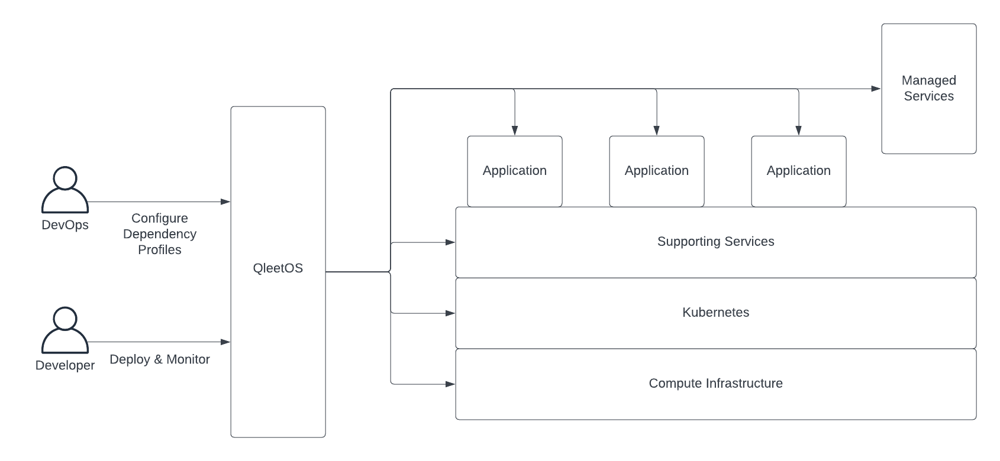

# QleetOS

QleetOS is a distributed operating system for managing modern containerized
software deployments.

Fundamentally, it exists to reduce engineering toil and increase resource
consumption efficiency in delivering software to its users.  This leads to
greater development velocity as well as lowered engineering and infrastructure
costs.

It is designed and built upon the following principles:

* Workloads should not be platform aware.  Rather platforms should be workload
  aware and provide application dependencies all the way down to the
  infrastructure when, and only when, they are needed by the workload.
* Sophisticated Kubernetes application platforms should be as easy to use as a
  developer workstations.
* Software supply chains should be API-driven and the persistence layer for
  configuration should be stored in a database rather than a git repo.  Software
  delivery is most reliably handled by level-triggered controllers rather than
  disparate toolchains.

If you'd like to try it out, visit our [getting started
guide](guides/getting-started/).

If you'd like to learn about the architecture, check out our [architecture
overview](architecture/overview/).

