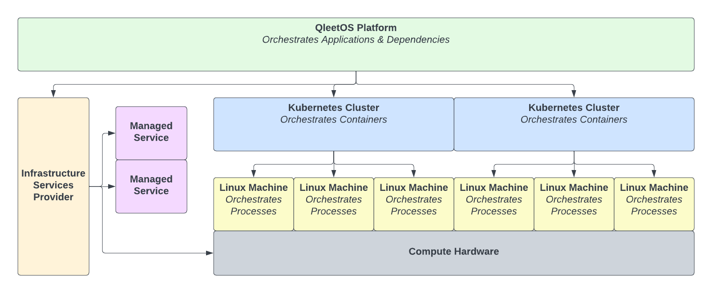
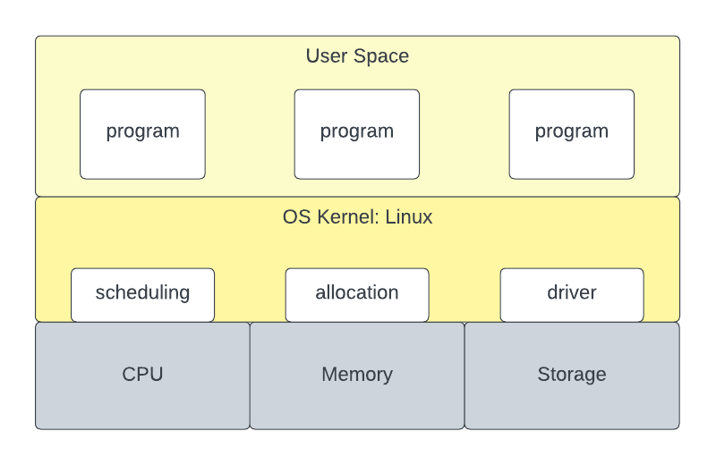
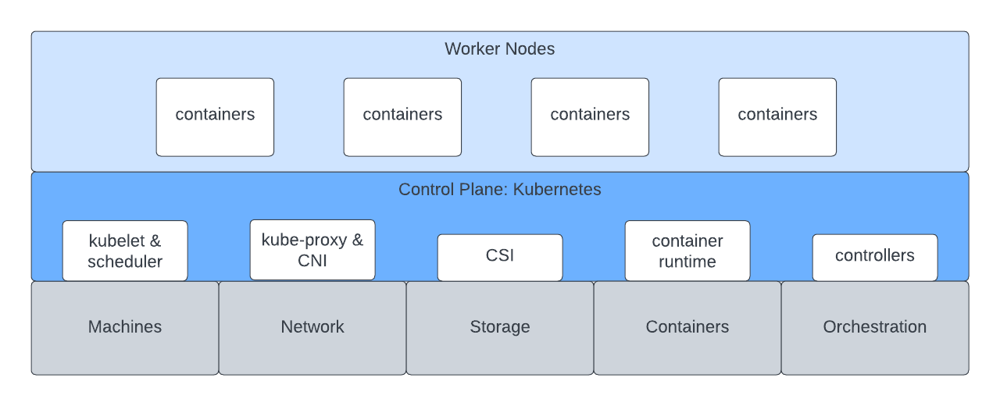
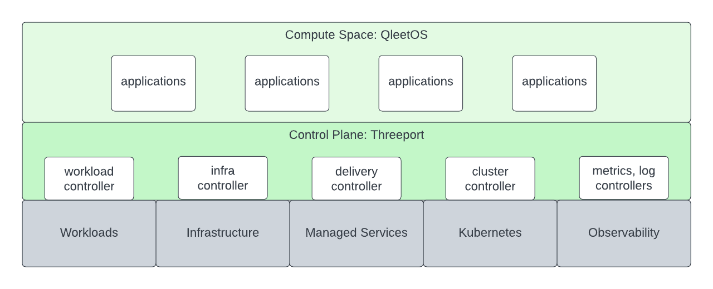

# QleetOS

QleetOS is an application orchestration engine.

It is a distributed operating system and control plane for managing modern
containerized software systems.  It is an application-centric platform that
manages the following concerns in response to app requirements:

* infrastructure
* container orchestration
* installed supporting services
* infra provider managed services

With QleetOS you provide a definition for your application that includes a
declaration of its dependencies, and QleetOS orchestrates all those dependencies
and runs your app.

## What QleetOS Is

QleetOS is a global abstraction layer.  To illustrate, let's examine the
abstractions that sit below it.

### Linux

Linux is an operating system for a single machine.  It provides abstractions for
the devices on a computer.  It allows us to write programs without integrating
directly with the underlying hardware.  The Unix operating systems enabled the
explosion of monolithic software.

### Kubernetes

Kubernetes is an operating system for a datacenter of machines.  It provides
abstractions for running containers across clusters of Linux machines.  It
allows us to manage software deployments at scale.  Kubernetes has enabled the
explosion of distributed software.

### Qleet

QleetOS is an operating system for a global software system.  It provides
abstractions for Kubernetes clusters and infrastructure providers.  It allows us
to manage software systems in any region for any supported infra provider
through a single control plane.  QleetOS is designed to enable the coming
explosion of decentralized and globally distributed software systems.

## What QleetOS Is Not

### QleetOS is not a Kubernetes Distribution

Kubernetes distributions provide installation of Kubernetes clusters along with
supporting services, or cluster addons.  They provide a way to install
Kubernetes clusters that are ready to accept workloads.  The workflow is
generally as follows:

1. Platform engineers use the Kubernetes distro to install clusters and prepare
   them for use.
2. DevOps sets up CI/CD or GitOps pipelines to deploy into those clusters.
3. Developers push changes to config repos that trigger delivery of workloads to
   the clusters.

QleetOS performs cluster install and preparation in response to application
deployments as needed.  The workflow is as follows:

1. Operations installs the QleetOS control plane.
2. Operations creates dependency profiles that are not satisfied by the
   existing system defaults.  This could include profiles for clusters, managed
   services or installed supporting services.
3. Developers provide workload configs with dependency declarations to QleetOS.
   QleetOS orchestrates the deployment of the application and its dependencies.

### QleetOS is not a Continuous Integration System

Traditional CI includes automated testing and build processes for software.  The
existing tools and systems used by developers today for this are perfectly
adequate.  QleetOS requires no change to these developer workflows.

In order to integrate QleetOS, simply add a call to the QleetOS control plane
to notify it of a new build of a container image at the end of your CI process.
QleetOS will perform the delivery of the new version into the appropriate
environment/s.

## Summary

Fundamentally, QleetOS exists to reduce engineering toil and increase resource
consumption efficiency in delivering software to its users.  This leads to
greater development velocity as well as lowered engineering and infrastructure
costs.

It is designed and built upon the following principles:

* Workloads should not be platform aware.  Rather, platforms should be workload
  aware and provide application dependencies all the way down to the
  infrastructure when, and only when, they are needed by the workload.
* Sophisticated Kubernetes application platforms should be as easy to use as a
  developer workstations.
* Software supply chains should be API-driven and the persistence layer for
  configuration should be stored in a database rather than a git repo.  Software
  delivery is most reliably handled by level-triggered controllers rather than
  disparate toolchains.

If you'd like to try it out, visit our [getting started
guide](guides/getting-started/).

If you'd like to learn about the architecture, check out our [architecture
overview](architecture/overview/).

