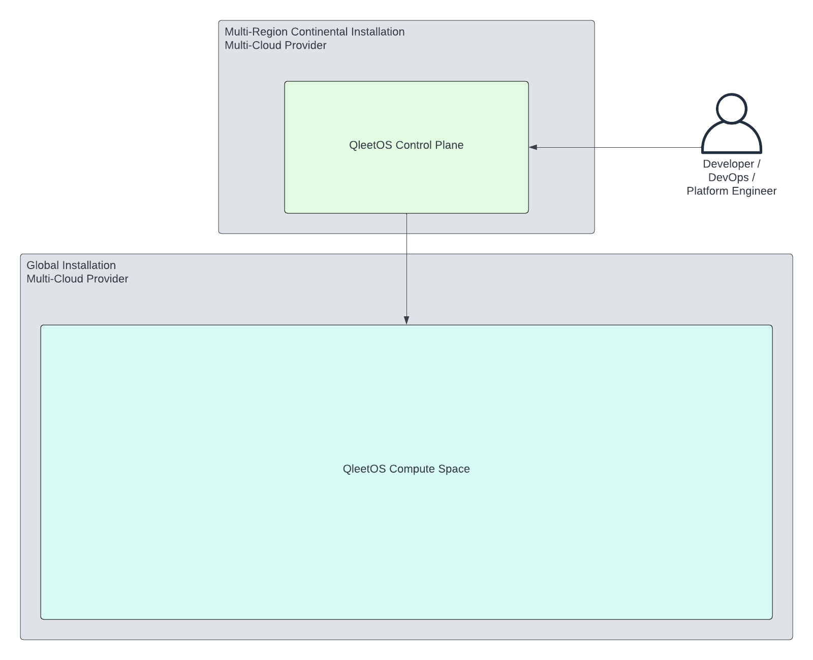
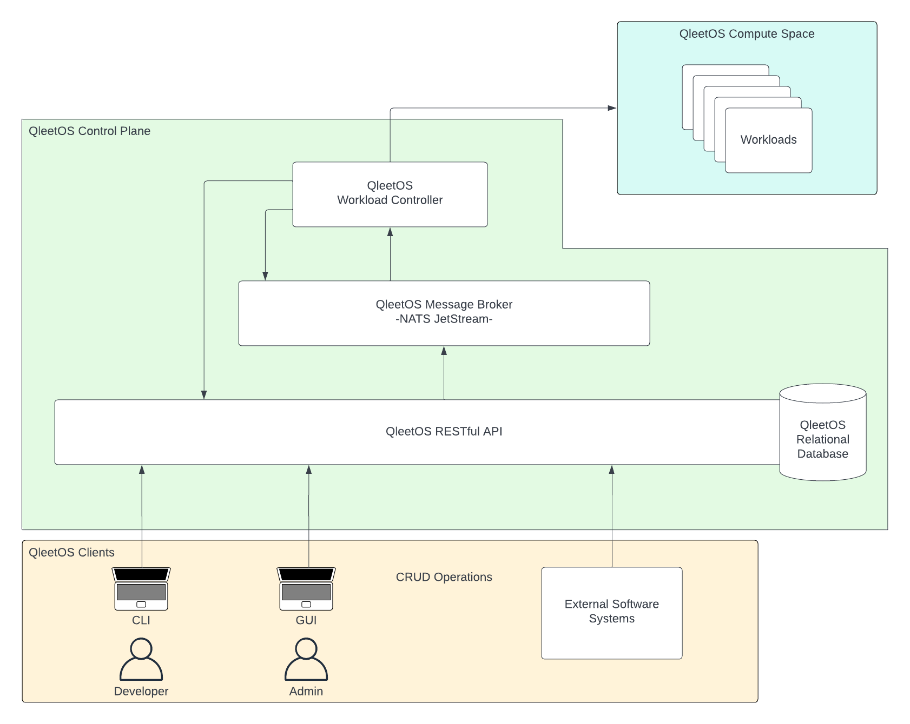
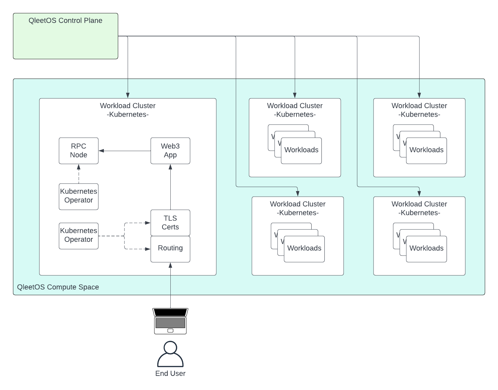

# QleetOS

QleetOS is a distributed operating system for managing complex software
deployments.

If you're managing containerized software with any of the following
requirements, QleetOS can help reduce operational toil, improve devloper
velocity and reduce production costs:

* tangled dependencies
* autoscaling
* multi-region
* multi-cloud

Developers and DevOps engineers interact with the control plane which deploys
and manages workloads into the compute space.

## Control Plane

The QleetOS control plane exposes a RESTful API that clients use to make changes
to the system.  QleetOS controllers are responsible for managing the state of
the system in response to changes made by clients.  When changes are made to
running softare deployments, the controllers connect to the compute space and
make the appropriate updates there.

## Compute Space

The QleetOS compute space is populated by Kubernetes clusters.  This is where
the software runs.  Those clusters can be run on whichever infrastructure
providers that are supported by QleetOS in as many regions as needed to meet
your apps' requirements.

