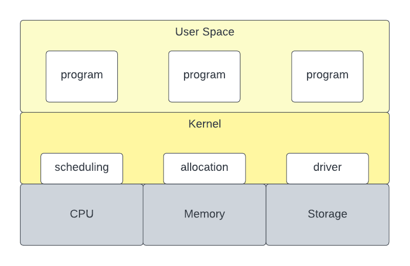
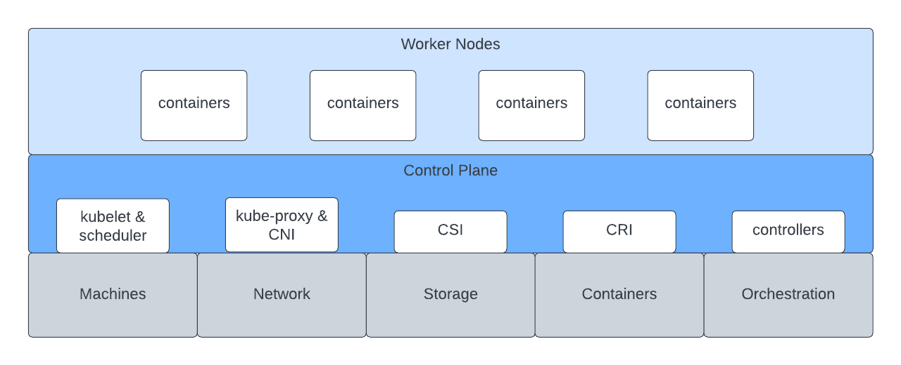
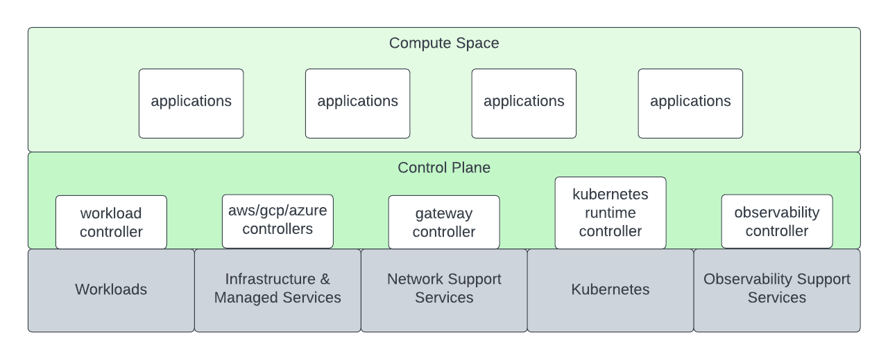

# Orchestration Abstractions

Threeport was built on top of the shoulders of giants.  This document describes
how we see Threeport in the context of the cloud native software stack and how
we build upon previous advancements.

## Linux

Linux is an operating system for a single machine.  It provides abstractions for
the devices on a computer and orchestrates process on that machine.  It allows
us to write programs without integrating directly with the underlying hardware.
The Unix operating systems enabled the explosion of monolithic software.

## Kubernetes

Kubernetes is an operating system for a datacenter of machines.  It provides
abstractions for scheduling, network and storage, and orchestrates containers in
a single geographical region.  It facilitates managing software deployments at
scale and has enabled the explosion of distributed software.

## Threeport

Threeport is an operating system for all of your datacenters globally.  It
provides abastractions for workload dependencies and orchestrates application
delivery to any location.  Threeport manages cloud provider infrastructure,
Kubernetes clusters, managed services and support services installed on
Kubernetes.  These are all managed in service of the application you need to
deliver.  Threeport is designed to enable the explosion of decentralized and
globally distributed software systems.

