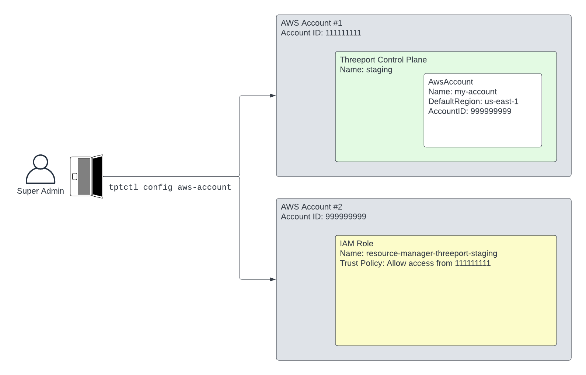

# AWS Cross-Account Access

Threeport control-planes can be configured to manage resources in a separate AWS account.

## Prerequisites

- An instance of the Threeport API: Follow the [getting started
guide](../getting-started.md) to set one up if you have not already done so. Note that EKS
clusters are currently the only supported type of control plane instance that can
authenticate to an external AWS account.

- AWS CLI: The `aws` CLI tool must be
[installed](https://docs.aws.amazon.com/cli/latest/userguide/getting-started-install.html)
and
[configured](https://docs.aws.amazon.com/cli/latest/userguide/cli-chap-configure.html).

## Configure AWS Account

`qleetctl config aws-account` configures AWS cross-account permissions. It creates an
`AwsAccount` object in the Threeport API and also configures the respective
externally-managed AWS account.



To run this command, the following flags must be provided:

- `--aws-account-name` - name of the AWS account that is being stored in the Threeport API
- `--aws-region` - the default AWS region that Threeport will manage resources in
- `--aws-profile` - the local AWS profile that will be used to authenticate to AWS
- `--aws-account-id` - the external AWS account to grant access to.


Here is an example of the complete command.  This command configures permissions
for the Threeport control plane in AWS Account #1 from the diagram above to
manage resources in AWS Account #2.

```bash
qleetctl config aws-account \
--aws-account-name my-account \
--aws-region us-east-1 \
--aws-profile my-profile \
--aws-account-id 111111111
```

Upon completion of the above command, you will be able to create Kubernetes runtime
instances in an external AWS account.
